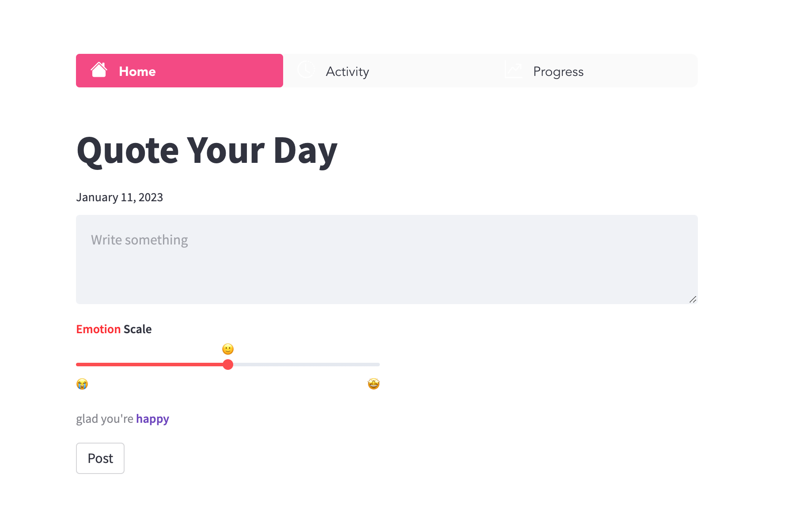
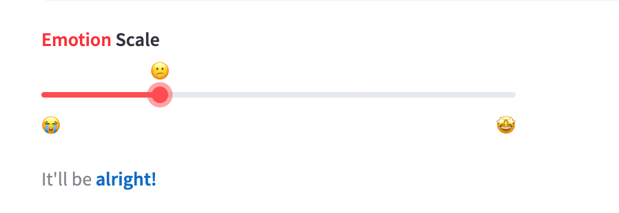
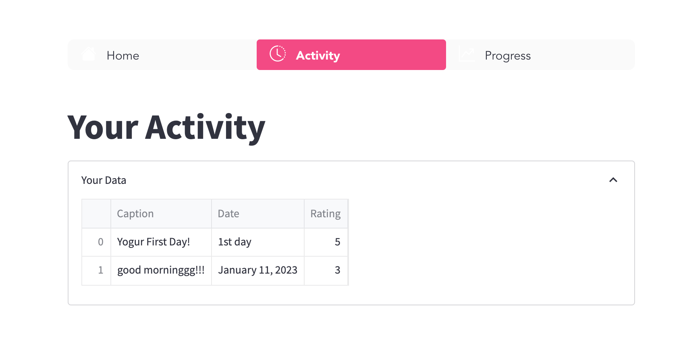

# QuoteYourDay
 **QuoteYourDay** is a simple webapp that allows users to post a quote daily and track their emotional status. The app is built using **Python**,
 **Streamlit** and utilizes **SQLite3** as the database management system. Streamlit is used to convert the Python application into a web-based 
 application, making it accessible via a web browser. The app serves as a tool for users to reflect on daily quotes and monitor their emotional 
 well-being.
# The App




 # Getting Started
 
 Install these few libraries to get your app running.
 
1.**Streamlit**
```
$ pip install streamlit
```
 2.**Streamlit_option_menu**
 
 ```
$ pip install streamlit_option_menu
```


# Running the app
CD into the project directory.
```
$ streamlit run main.py
```

Now, you're all good to go. Enjoy! :)

**Note: You can only quote once a day.**
